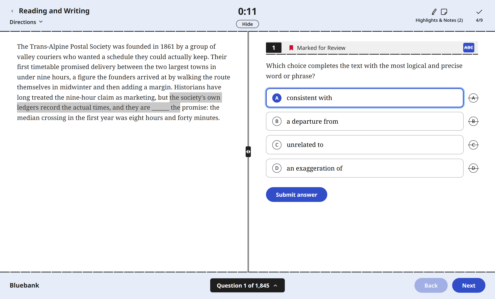

# Bluebank

This is a simple and modern UI for the official College Board SAT question bank. The tool does not store any actual question data, it pulls the questions from College Board themselves and just displays it. There are official explanations for each problem and stats to help you figure out what section you need to study more on.

The site is at [jackwangxyw.github.io/Bluebank](https://jackwangxyw.github.io/Bluebank/).



## Features

- Interface built off of Bluebook, the app you actually take the test in, so it isn't new to you on test day
  - Reading and writing puts the passage on one side and the question on the other, with a divider you can drag
  - Math puts the figure above the question, and comes with the Desmos calculator in the same restricted version College Board gives you
- Highlighting and notes, answer cross out, and marking a question to come back to
- Navigator showing which questions you've done, which you got wrong, and which you marked
- Practice sets built from any combination of filters
  - Section, domain, skill, difficulty and history. Everything except section takes more than one value at a time, so medium and hard together is one set rather than two
  - 10, 20, 30, 50 or your own number, pulled at random from whatever the filters allow
  - Optional timer at 0.75x, 1x, 1.25x or 1.5x the time the real test gives for that many questions
  - A checkbox to leave out the 2,019 questions that are also on the official practice tests, so the tests are still worth sitting later
- College Board's own explanation of why each choice is right or wrong, on every multiple choice question
- A mistake log, so after you answer you can record why you got it wrong (process, silly, knowledge or other) plus a note to yourself
- Review page holding every question you've answered, grouped by section and by day, with what you answered, how long it took, every earlier attempt at the same question, your notes and the explanation. Filter it down to the ones you got wrong, or the ones you left a note on
- Stats by section, domain and skill, so you can aim your practice instead of guessing
- Mobile layout that keeps the aesthetic but lays questions out vertically instead of splitting them down the middle
  - Once a question has loaded, everything except the calculator keeps working with no connection
- Google login for syncing your data across devices, which you **DO NOT** need for normal use

Practice sets sync too, so one you start on a laptop is waiting on your phone. There's more information on our privacy and data collection on the about page of the site itself.

## Practice Sets
Set size is what separates a set from open practice. Pick a size and you get that many questions at random from whatever the filters allow, fixed once you start, so it's the same questions in the same order if you come back tomorrow or open it on your phone. Leave the size on All and you just practice until you stop. Running out of time ends a set.

A set doesn't mark anything as you go. You pick an answer, Next moves on, and you can go back and change it. The question list at the bottom has a Go to Review Page button like Bluebook's, and it turns blue once you've answered everything. On the last question Next becomes Review. That page shows which questions you've answered and which you haven't, and finishing there grades the whole set at once.

Unfinished sets wait for you on the home page. Finished ones move to the review page with their score and open back onto the screen you saw when you finished. You can run one again with the same questions, which is a new set so the old score stays put, and you can delete either kind. A set's answers are a snapshot rather than a view over your attempts, so answering one of those questions again next week doesn't change what the set scored, and deleting a set leaves the attempts alone.

Outside a set every question is marked the moment you answer it, and that's where the explanations and the mistake log show up.

## Quick Start for Self Hosting
Everything from here down is for running your own copy. If you just want to use the site, you're done.

You need Python 3.9 or newer and Node. Only the localhost backend needs this build, since the static one downloads nothing until you open it.

```
python -m bluebank build     # index, fetch, normalize
cd web && npm install && npm run build
cd .. && python -m bluebank serve
```

Then open http://localhost:8000. Give it about five minutes, almost all of it pass 2 pulling 3,767 question bodies at 12.8 requests a second. If you only want to poke at the data, `build` on its own is enough and you can skip the web part.

For frontend work, run `python -m bluebank serve` in one terminal and `npm run dev` in another. Vite sits on 5173 and proxies `/api` to 8000, so you get hot reload against the real data.

## Two Backends
The frontend talks to one module, [web/src/api.ts](web/src/api.ts), and nothing else in the app touches the network or storage. That module picks between two implementations at build time.

| | localhost | static build |
| :--- | :--- | :--- |
| Questions | Python server and SQLite | College Board direct, cached in IndexedDB |
| Up front | the whole bank, about five minutes | the index only, 1.7 seconds |
| Grading | server | browser |
| Answer key | withheld until you answer | necessarily in the browser |
| Progress | `data/bluebank.db` | IndexedDB, optionally synced |

```
npm run build         # -> dist/        localhost
npm run build:pages   # -> dist-pages/  static, no server
```

`?backend=local` or `?backend=http` overrides the choice for one page load, which is handy for testing the static path against the dev server without a separate build.

The two don't share progress. Answering on one doesn't show up on the other, and only the static build can sync.

The static build depends on College Board sending `Access-Control-Allow-Origin: *`, which they currently do on all four endpoints. That header is theirs to change, and if they tighten it the static build stops working in a browser while the Python one keeps going, since a server ignores CORS.

## Commands
| Command | What it does |
| :--- | :--- |
| `index` | Pass 1, builds `data/index.json` from two API calls, plus `data/live.json` |
| `fetch` | Pass 2, downloads question bodies into `raw/`, resumable |
| `normalize` | Pass 3, parses everything into SQLite |
| `build` | All three |
| `serve` | API plus the built frontend on :8000 |
| `stats` | Counts by section, domain and type |
| `show <id>` | Prints one question |
| `answer <id> <response>` | Grades from the command line |
| `audit` | Lists flagged questions, should be exactly 3 |
| `import <file.json>` | Loads questions from a file instead of the API |

`fetch` skips anything already in `raw/` with a matching `updateDate`, so re-running it after an interruption picks up where it stopped. `--force` on any of the first four ignores that and refetches everything. `--strict` makes them exit nonzero when something gets flagged, which is what you'd want if you ever ran this on a schedule. `serve` takes `--host 0.0.0.0` to reach it from your phone on the same network.

## Where the Data Lives
Four tables in [data/bluebank.db](data) are yours: `attempts`, `annotations`, `marks` and `mistakes`. Everything else re-downloads. That's a couple of KB of real data sitting inside a 47 MB file, so back up the tables rather than the database.

```
python -c "
import sqlite3, json, io
c = sqlite3.connect('data/bluebank.db'); c.row_factory = sqlite3.Row
out = {t: [dict(r) for r in c.execute('select * from %s' % t)] for t in ('attempts','annotations','marks','mistakes')}
io.open('progress-backup.json','w',encoding='utf-8').write(json.dumps(out, indent=1))"
```

To wipe your progress and keep the questions, delete from those same four tables. To wipe everything, `rm -rf data raw` and run `build` again.

On the static build it's IndexedDB under database `bluebank`, and `indexedDB.deleteDatabase('bluebank')` in the console clears it. The app calls `navigator.storage.persist()` on startup so the browser won't evict the cache under storage pressure. If you've signed in, clearing that only clears this device, and the delete button in the sync panel is what removes the copy on the server.

The cached index is re-read after a week, in the background so it never costs you a cold start. Without that it was fetched once on your first visit and never again, so new questions added to the bank would never show up on that device.

## Deploying the Static Build
[.github/workflows/pages.yml](.github/workflows/pages.yml) builds `dist-pages/` and publishes it on every push to main. It runs `npm test` first and won't deploy a red suite. Two things it can't do for you.

Turn Pages on before the first run, under repo Settings, Pages, Build and deployment, with Source set to GitHub Actions. Leave it on the default and the build passes while the deploy step fails.

Vite needs a base path or every asset 404s, including the vendored MathJax. The workflow passes your repo name, so a fork deploys with no edit. A local `npm run build:pages` hardcodes `/Bluebank/` instead, so use `BASE=/ npm run build:pages` for a custom domain, or `BASE=/your-repo/` for anything else.

## Running Your Own Sync Server
Skip this unless you want sync on your own deployment. Leave `VITE_SYNC_API` and `VITE_GOOGLE_CLIENT_ID` blank in [web/.env.pages](web/.env.pages) and the account UI doesn't render at all, which is also the rollback.

The server is one Cloudflare Worker over a D1 database, in [worker/](worker). Create a D1 database and paste [worker/schema.sql](worker/schema.sql) into its Console. Create a worker and paste in [worker/src/index.js](worker/src/index.js). Under Settings, Bindings, add a D1 binding named exactly `DB`. Under Settings, Variables and Secrets, add `GOOGLE_CLIENT_ID` as a secret. Then put the worker URL and that same client id into `.env.pages`.

**Edit `ALLOWED_ORIGINS` at the top of `index.js` before you deploy it.** It's a hardcoded list that ships with my origin in it, so until yours is in there every request from your site comes back 403 and nothing about the failure points at this. Scheme and host only, no trailing slash and no path.

The client id has to come from a Web application OAuth client in the Google Cloud Console, with that same origin listed under Authorized JavaScript origins. Google's list, `ALLOWED_ORIGINS` and `.env.pages` all have to agree, and one of them disagreeing is the usual reason sign-in fails. `GET /health` reports which bindings actually landed and which client id the worker thinks it has, so check that first. Saving a binding in the dashboard without hitting Deploy leaves it missing at runtime and nothing else tells you.

`ALLOWED_SUBS` is optional. Unset, anyone with a Google account can sign in and gets their own private row. Set to a comma separated list of Google subs, it locks the deployment to those accounts. While it's still unset, every sign-in prints that account's sub to Worker, Logs, Live, which is the only place to read your own, and no email goes with it.

Attempts merge by union on a uuid, so a sync that fails, runs twice, or arrives out of order can't lose or duplicate anything. Marks, annotations, the mistake log and sets are last write wins, decided on the server so a device with a wrong clock can't stomp newer data. If you set this up before the mistake log or the `sets` table existed, re-run `schema.sql` and re-paste the worker. Every statement is `CREATE TABLE IF NOT EXISTS`, so running it again is safe and only adds what's missing.

## The API
Four endpoints, no authentication of any kind. Confirmed with bare curl sending only `Content-Type`, and confirmed again from a real browser on a foreign origin.

```
POST https://qbank-api.collegeboard.org/msreportingquestionbank-prod/questionbank/digital/get-questions
     {"asmtEventId": 99, "test": 1, "domain": "INI,CAS,EOI,SEC"}   # 1 = RW, 2 = Math
POST .../questionbank/digital/get-question   {"external_id": "..."}
GET  https://saic.collegeboard.org/disclosed/{ibn}.json
GET  .../questionbank/lookup                 # no body, see below
```

Math domains are `H,P,Q,S`. Difficulty is E/M/H, but there's also `score_band_range_cd`, which runs 1 to 7 and is finer, so use that one if you ever build adaptive logic on top of this.

The whole index is those first two calls and takes 1.7 seconds. They return 3,770 stubs, three of which are the same question filed twice under different ids, so the pipeline keeps the newer of each pair and you end up with 3,767. The individual bodies are what take five minutes. A stub carries an `external_id` or an `ibn`, never both. The 459 `ibn` items are the older disclosed set, from a different host in a different shape, and they're the ones the parser has to work for.

`lookup` is the one that isn't obvious. It returns `readingLiveItems` and `mathLiveItems`, 1,110 and 927 external_ids, and those are the questions that also sit on an official full-length practice test. It's what College Board's own bank means by "Exclude Active Questions", and it's how the same filter works here. Their frontend matches on `external_id` against the list for that section only, so an `ibn` item is never on a test and a Reading id can't take a Math question out. Both rules are copied rather than guessed, and pinned in the tests on both sides. 2,019 of the 3,767 questions are on a test, so excluding them leaves 1,748, which is 753 reading and writing and 995 math.

That list gets written to `data/live.json` in pass 1 and `normalize` turns it into a `live` column, so pass 3 stays a pure function of what's on disk and a `lookup` that fails costs you the filter rather than the build. The static build keeps the same list in IndexedDB and re-reads it whenever it re-reads the index.

## Explanations
Each rationale arrives as one HTML blob covering all four choices, and [bluebank/rationale.py](bluebank/rationale.py) splits it into a piece per choice. It cuts the HTML rather than flattened text, so MathML and inline SVG survive, and each piece gets rebalanced because the cuts land in the middle of a paragraph.

The wording varies more than you'd expect. `&nbsp;` shows up inside "Choice A&nbsp;is", the letter is sometimes wrapped in a tag, rejections come grouped as "Choices A, B, and C are incorrect", the verb goes missing in "Choice B incorrect.", and the `ibn` items use "<p>Incorrect Answer Rationale<br>" headers with no terminating period. Two shapes have to not match. "choice D is the only graph that passes through the point" is a mid sentence reference, and "Choices B and D show models of the form" is a plural reference rather than a rejection. Splitting on either of those truncates somebody's explanation.

The same file recovers the answer key for the 81 `ibn` items that ship without one, by reading it back out of the rationale prose. Ambiguity is flagged rather than guessed at, and `key_recovered` marks every question whose key came from there instead of from College Board's own field.

`normalize` cross checks the split against the key. Exactly one per choice explanation has to read as "correct" and it has to be the keyed choice. That agrees on all but two multiple choice questions, and both of those are real defects in College Board's own text, where the options were reordered and the prose wasn't updated. Left alone they'd tell a student who picked D that they were right, so their per choice mapping gets dropped and you see the whole rationale instead.

`python -m bluebank audit` should report exactly 3. The third is a question whose rationale never names choice A at the start of a sentence, so A is the only choice with no explanation of its own and the other three keep theirs. More than 3 means something in the parser broke.

## Grading
`correct_answer` is a list, and it mixes two different things: alternate spellings of one value like `["0.25", "1/4"]`, and genuinely different valid answers like `["7", "8", "13"]` for "one possible value of a". Grading is a membership test either way, so the review screen shows every accepted form rather than the first one.

A response is also accepted if it's numerically equal to a listed answer, so typing 1.5 for a listed 3/2 is right. That comparison uses exact rational arithmetic, `Fraction` in Python and a BigInt fraction in TypeScript. Floats get 3/17 wrong.

## Ordering
Sets are ordered by `shuffle_key`, which is FNV-1a over the question id with a splitmix64 finalizer, in [bluebank/db.py](bluebank/db.py) and mirrored in [web/src/lib/shuffle.ts](web/src/lib/shuffle.ts). The two return identical values and the tests pin them. Without it, section sorts before domain and you get every Math question before the first Reading one. With it, question 40 is the same question tomorrow, after a rebuild, and on the other backend, because the key comes from the id rather than from stored state.

The finalizer isn't optional. Raw FNV-1a barely reaches the high bits, which are the ones a sort reads, so every id starting with the same letter lands together and the shuffle is really a sort by first character.

The set clock comes from [web/src/lib/pacing.ts](web/src/lib/pacing.ts), which holds the two numbers the whole thing rests on: 32 minutes for 27 reading and writing questions, 35 for 22 math. A set is priced per question from those, since it can be any length and can mix the sections.

## Vendored Assets
MathJax is vendored at [web/public/mathjax/mml-svg.js](web/public/mathjax) and outputs SVG, so there are no font files to fetch and it works offline. Noto is self hosted in [web/src/fonts](web/src/fonts) rather than loaded from Google, since a font CDN sees the IP of every visitor whether or not they ever sign in.

Two things do reach out, and only when you ask for them. Desmos loads from their CDN the first time you open the calculator, running in their restricted testing mode (the `restrictedFunctions` option, which is what College Board uses). Google's sign-in script isn't fetched until you click sign in, so someone who never opens the account panel never talks to Google at all.

## Tests
```
python -m pytest tests -q     # 86
cd web && npm test            # 86
```

The rationale parser and the grader exist in both Python and TypeScript, and the TypeScript ports were checked against the Python by running both over the whole corpus: every rationale split identically, every explanation classified identically, every recovered key identical. The HTML in the committed cases is paraphrased rather than copied, so no question content is in the repo.
