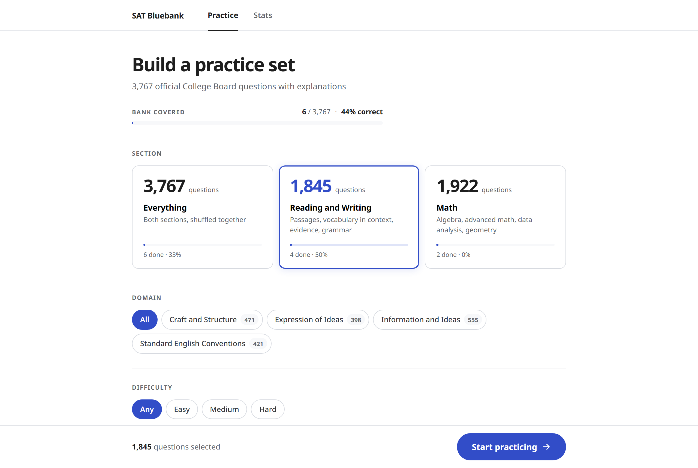
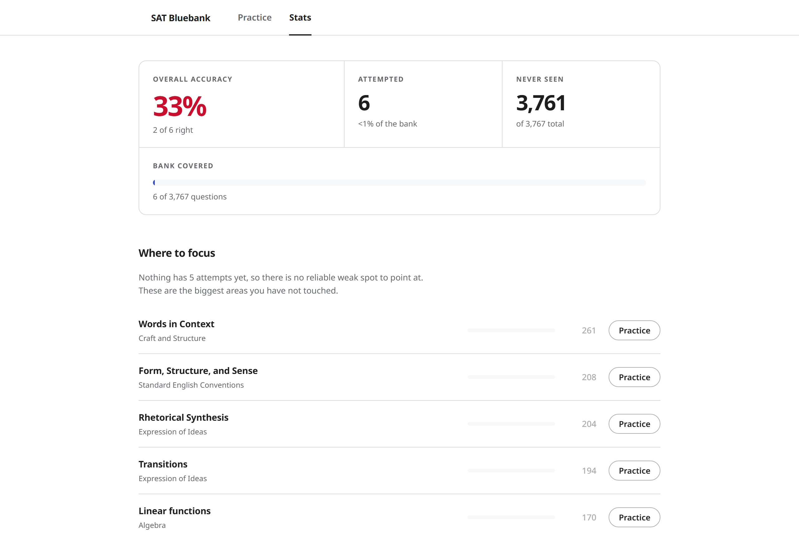

# SAT Bluebank

A practice app for the official College Board SAT question bank, laid out like Bluebook. It grades your answer against the real key and then shows College Board's own explanation, including the one for the choice you actually picked. There are 3,767 questions and 3,301 of the multiple choice ones have a per choice explanation.

The repo is code only. No question content is committed, and none of it is in the built site either. The app fetches the bank from College Board at runtime and keeps it locally, so the first thing you do after cloning is download it.




## Read this first
The College Board site terms say you may not "decompile, reverse engineer, scrape or data-mine College Board Services or Content", and that their content may not be "distributed, downloaded, uploaded, reproduced" without written permission. This project does the thing that clause describes. It's non-commercial and it's personal study, which is the best position you can be in here, but that's a mitigation and not permission. Run it locally for yourself and you're in the same place as anyone saving a practice question. Host it publicly and you're the one distributing, which is a different thing.

I'm not a lawyer and this isn't legal advice.

## Quick start
You need Python 3.9 or newer and Node. The build takes about five minutes, almost all of it downloading 3,767 question bodies at 12.8 requests a second.

```
python -m satbluebank build     # index, fetch, normalize
cd web && npm install && npm run build
cd .. && python -m satbluebank serve
```

Then open http://localhost:8000. If you only want to poke at the data, `build` on its own is enough and you can skip the web part entirely.

For frontend work, run `python -m satbluebank serve` in one terminal and `npm run dev` in another. Vite sits on 5173 and proxies `/api` to 8000, so you get hot reload against the real data.

## Two backends
The frontend talks to one module, [web/src/api.ts](web/src/api.ts), and nothing else in the app touches the network or storage. That module picks between two implementations at build time.

| | localhost | static build |
| :--- | :--- | :--- |
| Data | Python server and SQLite | College Board direct, cached in IndexedDB |
| Loading | whole bank up front, about 5 minutes | index in 1.7 seconds, bodies on demand |
| Grading | server | browser |
| Answer key | withheld until you answer | necessarily in the browser |
| Progress | `data/bluebank.db` | IndexedDB |

```
npm run build         # -> dist/        localhost
npm run build:pages   # -> dist-pages/  static, no server
```

`?backend=local` or `?backend=http` overrides it for one page load, which is handy for testing the static path against the dev server without a separate build.

The two don't share progress. Answering on one doesn't show up on the other.

The static build depends on College Board sending `Access-Control-Allow-Origin: *`, which they currently do on all three endpoints. That header is theirs to change and if they tighten it the static build stops working in a browser while the Python one keeps going, since a server ignores CORS. That's most of the reason both still exist.

## Commands
| Command | What it does |
| :--- | :--- |
| `index` | Pass 1, builds `data/index.json` from two API calls |
| `fetch` | Pass 2, downloads question bodies into `raw/`, resumable |
| `normalize` | Pass 3, parses everything into SQLite |
| `build` | All three |
| `serve` | API plus the built frontend on :8000 |
| `stats` | Counts by section, domain and type |
| `show <id>` | Prints one question |
| `answer <id> <response>` | Grades from the command line |
| `audit` | Lists flagged questions, should be exactly 3 |
| `import <file.json>` | Loads questions from a file instead of the API |

`fetch` skips anything already in `raw/` with a matching `updateDate`, so re-running it after an interruption picks up where it stopped.

## Where your data lives
Three tables in [data/bluebank.db](data) are yours: `attempts`, `annotations` and `marks`. Everything else re-downloads. That's about 2 KB of real data sitting inside a 47 MB file, so back up the tables rather than the database.

```
python -c "
import sqlite3, json, io
c = sqlite3.connect('data/bluebank.db'); c.row_factory = sqlite3.Row
out = {t: [dict(r) for r in c.execute('select * from %s' % t)] for t in ('attempts','annotations','marks')}
io.open('progress-backup.json','w',encoding='utf-8').write(json.dumps(out, indent=1))"
```

To wipe your progress and keep the questions, delete from those same three tables. To wipe everything, `rm -rf data raw` and run `build` again.

On the static build it's IndexedDB under database `satbluebank`, and `indexedDB.deleteDatabase('satbluebank')` in the console clears it. The app calls `navigator.storage.persist()` on startup so the browser won't evict the cache under storage pressure.

## The API
Three endpoints, no authentication of any kind. Confirmed with bare curl sending only `Content-Type`, and confirmed again from a real browser on a foreign origin.

```
POST https://qbank-api.collegeboard.org/msreportingquestionbank-prod/questionbank/digital/get-questions
     {"asmtEventId": 99, "test": 1, "domain": "INI,CAS,EOI,SEC"}   # 1 = RW, 2 = Math
POST .../questionbank/digital/get-question   {"external_id": "..."}
GET  https://saic.collegeboard.org/disclosed/{ibn}.json
```

Math domains are `H,P,Q,S`. Difficulty is E/M/H, but there's also `score_band_range_cd`, which runs 1 to 7 and is finer, so use that one if you ever build adaptive logic on top of this.

The whole index is those first two calls and takes 1.7 seconds. The 3,767 individual bodies are what take five minutes.

## Explanations
Each rationale arrives as one HTML blob covering all four choices, and [satbluebank/rationale.py](satbluebank/rationale.py) splits it into a piece per choice. It cuts the HTML rather than flattened text, so MathML and inline SVG survive, and each piece gets rebalanced because the cuts land in the middle of a paragraph.

The wording varies more than you'd expect. `&nbsp;` shows up inside "Choice A&nbsp;is", the letter is sometimes wrapped in a tag, rejections come grouped as "Choices A, B, and C are incorrect", the verb goes missing in "Choice B incorrect.", and the `ibn` items use "<p>Incorrect Answer Rationale<br>" headers with no terminating period.

Two shapes have to not match. "choice D is the only graph that passes through the point" is a mid sentence reference, and "Choices B and D show models of the form" is a plural reference rather than a rejection. Splitting on either of those truncates somebody's explanation.

## Correctness guards
Two bugs in here silently produced wrong answer keys before they were caught, which is worse than a missing key because it tells you the wrong thing and you never find out.

| Bug | Effect |
| :--- | :--- |
| `.strip(".")` on a recovered answer | Turned `.1667` into `1667`, and it was live in the database |
| `([^.]+?)` in the SPR pattern | Can't cross a decimal point, so "The correct answer is 0.25." captured `0` |
| `re.findall("[A-D]", "A, B, and C", IGNORECASE)` | Also matches the a and d in "and" |
| `{_SP}?` where `_SP` is `(?:...)+` | Compiles to a lazy one-or-more instead of an optional group |

`normalize` also cross checks the split against the key. Exactly one per choice explanation has to read as "correct" and it has to be the keyed choice. That agrees on 3,301 of 3,303 multiple choice questions. The two that don't are real defects in College Board's own text where the options were reordered and the prose wasn't updated, so their per choice mapping gets dropped and you see the whole rationale instead. Left alone they'd tell a student who picked D that they were right.

`python -m satbluebank audit` should report exactly 3 flagged questions. If it reports more, something in the parser broke.

## Grading
`correct_answer` is a list, and it mixes two different things: alternate spellings of one value like `["0.25", "1/4"]`, and genuinely different valid answers like `["7", "8", "13"]` for "one possible value of a". Grading is a membership test either way, so the review screen shows every accepted form rather than the first one.

A response is also accepted if it's numerically equal to a listed answer, so typing 1.5 for a listed 3/2 is right. That comparison uses exact rational arithmetic, `Fraction` in Python and a BigInt fraction in TypeScript. Floats get 3/17 wrong.

## Ordering
Sets are ordered by `shuffle_key`, which is FNV-1a over the question id with a splitmix64 finalizer, in [satbluebank/db.py](satbluebank/db.py) and mirrored in [web/src/lib/shuffle.ts](web/src/lib/shuffle.ts). The two return identical values and the tests pin them.

Without it, section sorts before domain and you get all 1,922 Math questions before the first Reading one. With it, question 40 is the same question tomorrow, after a rebuild, and on the other backend, because the key comes from the id rather than from stored state.

The finalizer isn't optional. Raw FNV-1a barely reaches the high bits, which are the ones a sort reads, so every id starting with the same letter landed together and the "shuffle" was really sorting by first character.

## Tests
```
python -m pytest tests -q     # 32
cd web && npm test            # 57
```

The rationale parser and the grader exist in both Python and TypeScript, and the TypeScript ports were checked against the Python by running both over the whole corpus: all 3,767 rationales split identically, every explanation classified identically, every recovered key identical. The committed tests are the standing guard, that run was the one off proof. The HTML in the committed cases is paraphrased rather than copied, so no question content is in the repo.

## The app
Split pane with a draggable divider for Reading and Writing, figures inline above the question for Math, since that's how the real app does it. Highlighting and notes, cross out, a question navigator with a folded corner ribbon on anything marked for review, and the Desmos calculator on math questions.

The calculator runs in Desmos's restricted testing mode, which is their `restrictedFunctions` option. You can tell it took effect because the keypad key reads "funcs" rather than "functions", and the real Bluebook keypad also reads "funcs". It opens as a portrait window on purpose, because Desmos lays itself out responsively and a narrow container stacks the graph above the expression list the way Bluebook shows it. A landscape window puts the expressions down the left and looks nothing like it.

Highlight offsets are measured over text nodes only, skipping math, SVG and images. That's what lets MathJax replace every `<math>` with generated SVG without moving a highlight. Don't simplify the skip.

MathJax is vendored at [web/public/mathjax/mml-svg.js](web/public/mathjax) and outputs SVG, so there are no font files to fetch and it works offline. Desmos loads from their CDN the first time you open the calculator, and nothing else in the app needs the network once it's built.

## Screenshots and content
The screenshots in this README are the picker and the stats page, both of which show counts and no question text. A screenshot of the practice view would put a College Board passage, its answer choices and its rationale into a public repo, which is the one thing this project otherwise doesn't do.
